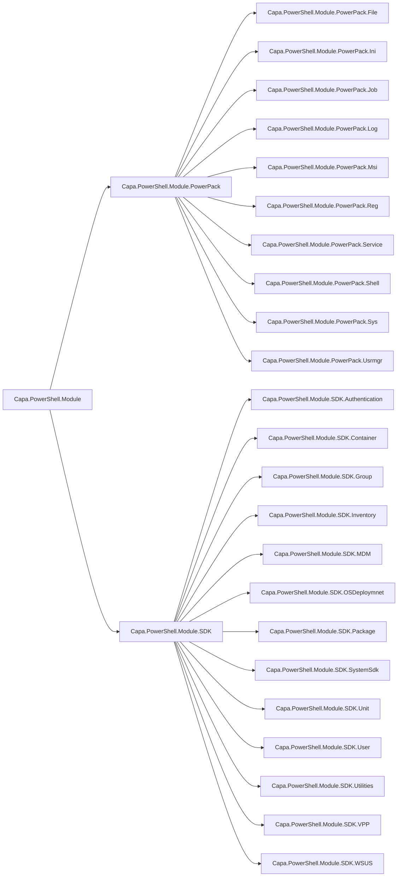

```mermaid
    graph LR
    A[Capa.PowerShell.Module]-->B[Capa.PowerShell.Module.PowerPack]
    B-->C[Capa.PowerShell.Module.PowerPack.File]
    B-->D[Capa.PowerShell.Module.PowerPack.Ini]
    B-->E[Capa.PowerShell.Module.PowerPack.Job]
    B-->F[Capa.PowerShell.Module.PowerPack.Log]
    B-->G[Capa.PowerShell.Module.PowerPack.Msi]
    B-->H[Capa.PowerShell.Module.PowerPack.Reg]
    B-->I[Capa.PowerShell.Module.PowerPack.Service]
    B-->J[Capa.PowerShell.Module.PowerPack.Shell]
    B-->K[Capa.PowerShell.Module.PowerPack.Sys]
    B-->L[Capa.PowerShell.Module.PowerPack.Usrmgr]
    A-->M[Capa.PowerShell.Module.SDK]
    M-->N[Capa.PowerShell.Module.SDK.Authentication]
    M-->O[Capa.PowerShell.Module.SDK.Container]
    M-->P[Capa.PowerShell.Module.SDK.Group]
    M-->Q[Capa.PowerShell.Module.SDK.Inventory]
    M-->R[Capa.PowerShell.Module.SDK.MDM]
    M-->S[Capa.PowerShell.Module.SDK.OSDeploymnet]
    M-->T[Capa.PowerShell.Module.SDK.Package]
    M-->U[Capa.PowerShell.Module.SDK.SystemSdk]
    M-->V[Capa.PowerShell.Module.SDK.Unit]
    M-->X[Capa.PowerShell.Module.SDK.User]
    M-->Y[Capa.PowerShell.Module.SDK.Utilities]
    M-->Z[Capa.PowerShell.Module.SDK.VPP]
    M-->A1[Capa.PowerShell.Module.SDK.WSUS]
```