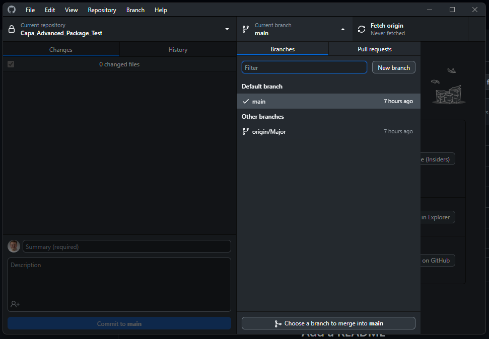

# Working with Git when creating or updating a package (advanced)

See [Working with Git when creating or updating a package](Working%20with%20Git%20when%20creating%20or%20updating%20a%20package.md) for a simpler flow.

## Requirements

This is a list of requiremnts the seloution needs to work. You should also have a look at the Recommendations section.

### Service Account

You are goint to need a service account with administartor rights to CapaInstaller and the server you wish to run the GitHub Actions Runner on.

The service account needs local administrator rights on the server to run the Capa.PowerShell.Module, which requires local administrator rights to funtion.

In CapaInstaller the service account needs to be able to:

- Create a package
- Update the packages kit folder
- Promote the package
- Export the package to a location

### GitHub Actions Runner

#### Local

To use the GitHub Actions Runner locally and acrross multiple repositories (packages) you need to create a self-hosted runner in a GitHub Organization. So do the following:

1. [Create a GitHub Organization](https://docs.github.com/en/organizations/collaborating-with-groups-in-organizations/creating-a-new-organization-from-scratch)
2. Add a self-hosted runner to your organization and when asked for a labe us `CapaServer`, if you don't use this label you need to change the `runs-on` property in the `main.yml` file in the `.github/workflows` folder in the repository. Follow this guide to setup the runner: [Adding self-hosted runners](https://docs.github.com/en/actions/hosting-your-own-runners/managing-self-hosted-runners/adding-self-hosted-runners#adding-a-self-hosted-runner-to-an-organization)

#### Cloud

Each time you create a Pull Request from your branch to the `main` branch, will it trigger a GitHub Action to generate an new package version. This action will use around 1 minute of the included 2000 minutes of free GitHub Actions per month.

This action only works on an `ubuntu-latest` runner.

For more information see [About billing for GitHub Actions](https://docs.github.com/en/billing/managing-billing-for-github-actions/about-billing-for-github-actions)

### CapaInstaller

We recommend that you have a development and production environment. This is to ensure that you don't break anything in the production environment.

If you don't wish to have a development environment, then you need to change the GitHub Action workflow `main.yml` file in the `.github/workflows` folder in the package/repository folder.

## Recommendations

This is a list of recommendations that we will recommend you to follow.

### Security setup in CapaInstaller

If you chose to make packages with this advanced flow, then we recommend that you change the securtiy settings in CapaInstaller to only allow the service account to have full access. But you should have 2 acounts:

- Admin: Can everything but only see development in Configuration Management.
- Normal: Can everything but only in your production environment.

This it to make CapaInstaller more secure in the way that you can only promote packages from the development environment to the production environment. If you have a colleague that has code revied your packages, then you can promote the package to the production environment.

This is also to ensure that you are up to date with the newest changes to packages. But also to ensure that your team follows the same standards, when creating packages.

If something goes wrong and you need it, the you can upgrade your admin account to have full access to everything for an time, just remember to downgrade it again.

### Branch protection rules

We recommend that you create a branch protection rule for the `main` branch, so that you can't push directly to the `main` branch. This is to ensure that you have a code review process in place.

To setup a branch protection rule, follow this guide: [Creating a branch protection rule](https://docs.github.com/en/repositories/configuring-branches-and-merges-in-your-repository/managing-protected-branches/managing-a-branch-protection-rule#creating-a-branch-protection-rule)

The settings we normally use are:

- Require pull request reviews before merging
  - Require aprovals
    - 1
  - Dismiss stale pull request approvals when new commits are pushed
- Requre status checks to pass before merging
  - Require branches to be up to date before merging
- Require conversation resolution before merging
- Do not allow bypassing branch protection

### Code review

We recommend that you have a code review process in place. This is to ensure that you and your team follows the same standards, when creating packages.

### Git Large File Storage (LFS)

If you have the resources, then we recommend that you use Git LFS to store all the files from the kit folder in the repository. So you have full control over the changes the package goes through.

But it is not nessesary! Then the PR is merged to the `main` branch, will the GitHub Action take the files from the kit folder of the old version and put them in the kit folder of the new version. And export the package to the location you have specified so you can restore the package if needed.

## Creating a new package

1. Create a local folder structure

		To create a new package you need to create a local folder structure that matches the structure of the package repository. You can use the following command to create the folder structure:

   ```powershell
   New-CapaPackageWithGit
    ```

		You need to specify the following parameters:
    * **SoftwareName** - The name of the package.
    * **SoftwareVersion** - The version of the package.
    * **PackageType** - The type of the package. Can be either **VBScript** or **PowerPack**.
    * **BasePath** - The path to the folder where the Git repository will be created. Use a personal folder like Documents.
    * **Advanced** - Is a switch to telle the command to create the folder structure for the advanced flow.

    You can also specify the following optional parameters so you don't have to specify them in UpdatePackage.ps1:
    * **CapaServer** - The name of the server you want to connect to.
    * **SQLServer** - The name of the SQL Server that hosts the CapaInstaller database.
    * **Database** - The name of the CapaInstaller database.
    * **DefaultManagementPoint** - The ID of the default management point.
    * **PackageBasePath** - The path to the ComputerJobs folder.

2. Create the repository and publish it GitHub
   1. Open GitHub Desktop > File > Add local repository...

   

   2. Choose the folder **C:\Temp\MyPackage\Capa_MyPackage** and click **create a repository**. If you get the message **Unable to create new repository because there are too many new files in this directory**, try and run GitHub Desktop as administrator.

    

    3. Click **Create repository**.

    

    4. Write a commit message and click **Commit to main**.

    

    5. Click **Publish repository** > **Publish repository**. I would recommend that you publish the repository to a private repository in a GitHub organization, but for this example, we will publish it to a personal repository.

    

3. In GitHub setup branch protection rules, if you want to use them.
4. Create a new branch in GitHub Desktop the name of the branch is not important.
   1. In GitHub Desktop click **Current branch** > **New branch**.

		

5. Open **Settings.json** and change the following settings to your needs:
	 - SoftwareName
	 - SoftwareVersion
	 - CapaServer
	 - SqlServer
	 - Database
	 - DefaultManagementPoint
	 - PackageBasePath
	 - Description
	 - ExportPath

	The settings are explained in the [Settings.json](#settings.json) section.

6. Make changes to the package
    In the scripts folder change the scripts to fit your needs.

    You can also create a folder named "kit" that contains the files that you want to include in the package. Important to note is that if a kit folder is present, that files over 100 MB will be a good idea to exclude from the commit to GitHub. If you want to include the big files in the commit to GitHub, then you need to use Git LFS (Large File Storage). You can read more about Git LFS [Here](https://docs.github.com/en/repositories/working-with-files/managing-large-files/about-git-large-file-storage).

    If you want to test the package run the script UpdatePackage.ps1 as an administrator. The script will create the package if it doesn't exist or update the package if it already exists.

7. Remember to make regular commits to GitHub so you can track the changes you make to the package.
8. When you are done with the package, then create a Pull Request from your branch to the `main` branch. And then merge the Pull Request.

## Updating an existing package

1. Clone the repository from GitHub: In GitHub Desktop click **File** > **Clone repository...** and choose the repository you want to clone.
2. Create a new branch in GitHub Desktop, if the name of the branch is like **Major** then the package version will be increased by 1.0. All other branch names will increase the package version by 0.1.
3. Depending on package/software copy the kit files from an older version.
4. If you are using the same repo to a newer version of the software, then you may like to change the following settings in **Settings.json**:
	 - SoftwareName
	 - SoftwareVersion
	 - Description
	 - ExportPath
	 - PackageVersion

## CapaPackages

If you are using CapaPackages, then you need to make a script and schedule it in taskscheduler.

We are working on making the script and will update this guide when it is ready.

## How to have multiple versions of the same software

If you want to have multiple versions of the same software, then you need to create a new repository for each version of the software.

This is because we want to keep the GitHub Actions workflow as simple as possible. And if we had to support multiple versions of the same software, then the workflow would be more complex.

You are welcome to change the workflow to support multiple versions of the same software. When you have done that, then you can use template repositories to create new repositories with the workflow already in place, so you don't have to copy the workflow to each repository. You can read more about template repositories [Here](https://docs.github.com/en/repositories/creating-and-managing-repositories/creating-a-template-repository)

## Repo structure

### .github/workflows

#### main.yml

#### versioning.yml

### Kit

### Scripts

### .gitingore

### Settings.json

### UpdatePackage.ps1