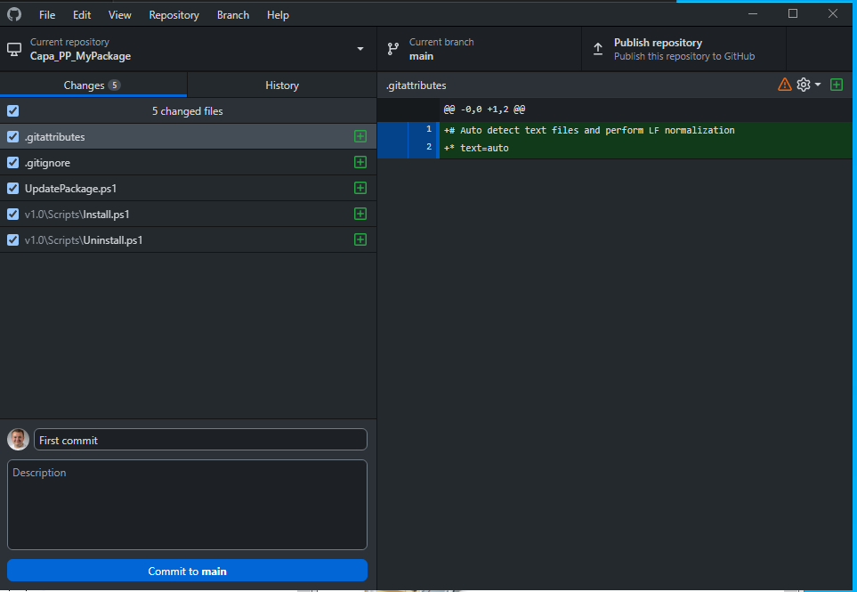

# Working with Git when creating or updating a package

This document describes how to use Git when creating or updating a package and how to contribute to the package repository.
You are encouraged to read this document before you start working with Git.

All the examples in this document are based on using GitHub as the package repository.

## Creating a new package

1. Creating local folder structure

   To create a new package you need to create a local folder structure that matches the structure of the package repository. You can use the following command to create the folder structure:

   ```powershell
   New-CapaPackageWithGit
    ```

    You need to specify the following parameters:
    * **PackageName** - The name of the package.
    * **PackageVersion** - The version of the package.
    * **PackageType** - The type of the package. Can be either **VBScript** or **PowerPack**.
    * **BasePath** - The path to the folder where the Git repository will be created. Recommended to use a that is personal to you like a folder in your Documents folder.

    You can also specify the following optional parameters so you don't have to specify them in UpdatePackage.ps1:
    * **CapaServer** - The name of the server you want to connect to.
    * **SQLServer** - The name of the SQL Server that hosts the CapaInstaller database.
    * **Database** - The name of the CapaInstaller database.
    * **DefaultManagementPoint** - The ID of the default management point.
    * **PackageBasePath** - The path to the ComputerJobs folder.

    The following example creates a new package named **MyPackage** with version **v1.0** of type **PowerPack** in the folder **C:\Temp\MyPackage**:

    ```powershell
    New-CapaPackageWithGit -PackageName MyPackage -PackageVersion v1.0 -PackageType PowerPack -BasePath C:\Temp\MyPackage
    ```

    The following folder structure will be created:

    ```text
    C:\Temp\MyPackage
    ├───Capa_MyPackage
    │   ├───.gitignore
    │   ├───UpdatePackage.ps1
    │   ├───v1.0
    │   │   ├───Scripts
    │   │   │   └───Install.ps1
    |   |   |   └───Uninstall.ps1
    ```

    Important do not change the name of the folder **Capa_MyPackage**. The name of the folder is used by the script UpdatePackage.ps1 to determine the package name and type (VBscript or PowerPack, only computer packages are supported at the momment).

2. Create the repository and publish to GitHub
   1. Open GitHub Desktop > File > Add local repository...

   

   2. Choose the folder **C:\Temp\MyPackage\Capa_MyPackage** and click **create a repository**. If you get the message **Unable to create new repository because there are too many new files in this directory**, try and run GitHub Desktop as administrator.

    

    3. Click **Create repository**.

    

    4. Write a commit message and click **Commit to main**.

    

    5. Click **Publish repository** > **Publish repository**. I would recommend that you publish the repository to a private repository in a GitHub organization, but for this example we will publish it to a personal repository.

    

3. Open the file **C:\Temp\MyPackage\Capa_MyPackage\UpdatePackage.ps1** in a text editor and change the following parameters:
      * **CapaServer** - The name of the server you want to connect to.
      * **SQLServer** - The name of the SQL Server that hosts the CapaInstaller database.
      * **Database** - The name of the CapaInstaller database.
      * **DefaultManagementPoint** - The ID of the default management point.
      * **PackageBasePath** - The path to the ComputerJobs folder.

4. Make changes to the package
    In the scripts folder changes the scripts to fit your needs.

    You can also create a folder named "kit" that contains the files that you want to include in the package. Important to note is that if a kit folder is present, that files over 100 mb will be a good idea to exclude from the commit to GitHub. If you want to include the big files in the commit to GitHub, then you need to use Git LFS (Large File Storage). You can read more about Git LFS [Here](https://docs.github.com/en/repositories/working-with-files/managing-large-files/about-git-large-file-storage).

    If you whant to test the package run the script UpdatePackage.ps1 as an administrator. The script will create the package if it doesn't exist or update the package if it already exists.

5. Remember to make regalur commits to GitHub so you can track the changes you make to the package.

## Updating an existing package

Run the script UpdatePackage.ps1 as an administrator. The script needs to be in the package folder or in one of the version folders.
E.g. either in **C:\Temp\MyPackage\Capa_MyPackage** or in **C:\Temp\MyPackage\Capa_MyPackage\v1.0**.

## Contributing to the package repository

1. Open GitHub Desktop > File > Clone repository...
2. Select the repository you want to clone > Check the Local Path > Click **Clone**.
3. Do as described in the sections [Creating local folder structure](#creating-a-new-package) & [Updating an existing package](#updating-an-existing-package).

## Creating a new package version

You can create a new version of a package by creating a new folder in the package folder and copying the files from the previous version to the new version folder. Or you can use the script New-CapaPackageVersion.ps1.
The script will create a new version folder and create new scripts.

When multiple versions of a package exists, the script UpdatePackage.ps1 will aske you which version you want to update.
To get around this you can copy the script UpdatePackage.ps1 to the version folder and run the script from there.

## Other useful things too look into

We will recommend that you use branches when working on a package and use code reviews when merging the changes to the main branch.
This will make it easier to track changes and encourage to have another person to test the package before it is merged to the main branch in GitHub and promoting the package to production in CapaInstaller.
